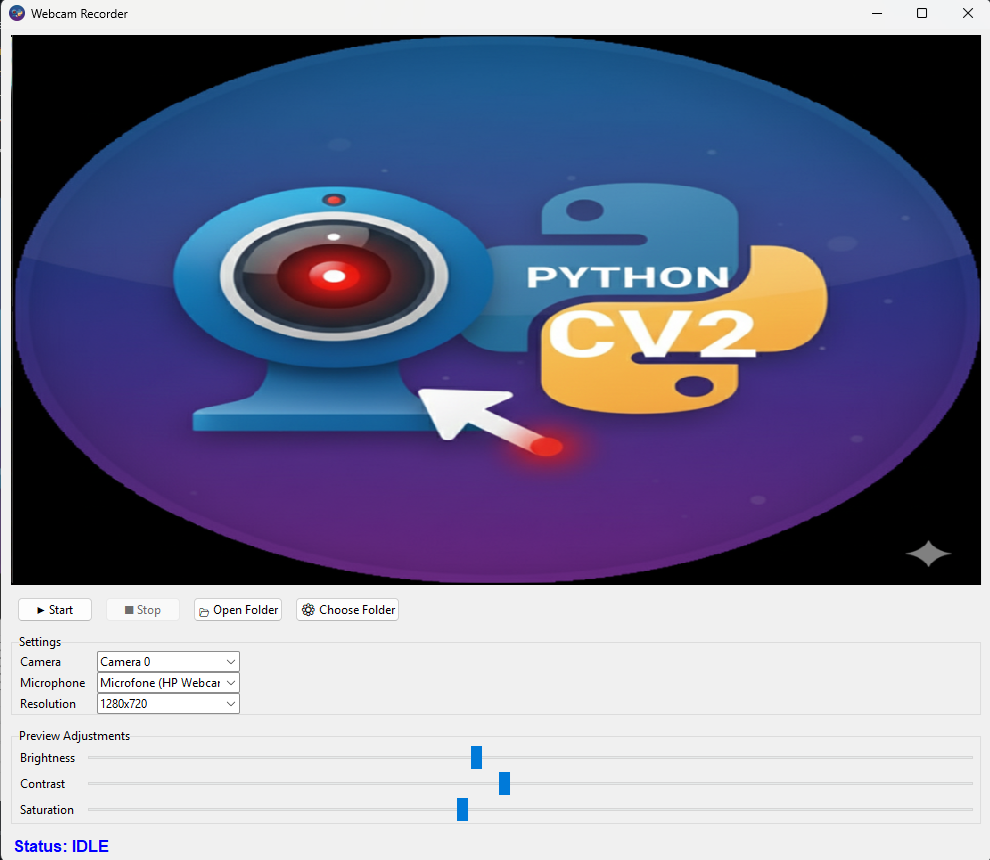

# 🎥 Webcam Viewer Recorder App

A **professional-grade desktop application** for **camera preview, video recording, and hardware control**, built with **Python, Tkinter, OpenCV, and FFmpeg**, designed with clean architecture, strong typing, and production-level documentation.

---

## 📘 Table of Contents

- [🎥 Webcam Viewer Recorder App](#-webcam-viewer-recorder-app)
  - [📘 Table of Contents](#-table-of-contents)
  - [🔥 Overview](#-overview)
  - [⚡ Key Features](#-key-features)
    - [📷 Camera Preview \& Control](#-camera-preview--control)
    - [🎞 Video Recording](#-video-recording)
    - [🎚 Image Controls](#-image-controls)
    - [🧠 Architecture](#-architecture)
  - [🏗 Project Architecture](#-project-architecture)
  - [🛠 Technologies](#-technologies)
  - [💻 Installation](#-installation)
  - [⚙ Configuration](#-configuration)
    - [📦 Extract FFmpeg](#-extract-ffmpeg)
    - [📂 Expected Structure](#-expected-structure)
  - [▶ Running the Application](#-running-the-application)
  - [📂 Directory Structure](#-directory-structure)
  - [📜 License](#-license)
  - [👤 Author](#-author)
  - [💬 Feedback](#-feedback)

---

## 🔥 Overview

This project is a **webcam viewer recorder desktop application** built for real-world usage, providing:

✔ Live camera preview  
✔ Resolution-safe preview with aspect ratio preservation  
✔ Video recording using FFmpeg  
✔ Brightness and contrast control  
✔ Clean UI with Tkinter  
✔ Hardware abstraction for cameras and microphones  



---

## ⚡ Key Features

### 📷 Camera Preview & Control

- Real-time preview using OpenCV
- Automatic frame scaling
- Thread-safe capture

### 🎞 Video Recording

- FFmpeg-based recording
- Stable video/audio pipeline

### 🎚 Image Controls

- Brightness & contrast adjustment

### 🧠 Architecture

- Fully typed
- English docstrings
- No dead code

---

## 🏗 Project Architecture

UI → AppWindow → Capture Services → OpenCV / FFmpeg

---

## 🛠 Technologies

- Python 3.10+
- Tkinter
- OpenCV
- NumPy
- FFmpeg

---

## 💻 Installation

```bash
git clone https://github.com/CelmarPA/webcam-viewer-recorder
cd webcam-viewer-recorder
python -m venv venv
source venv/bin/activate
pip install -r requirements.txt
```

---

## ⚙ Configuration

This project already includes **FFmpeg** packaged as a `.rar` file.

### 📦 Extract FFmpeg

No manual download is required.

Simply **extract the contents of the provided `.rar` file** into the project root, preserving the folder structure.

After extraction, the executable must be located at:

### 📂 Expected Structure

```

webcam-viewer-recorder/
│
~
├── ffmpeg/
│   └── ffmpeg.exe
│
~

```

## ▶ Running the Application

```bash
python main.py
```

---

## 📂 Directory Structure

```

webcam-viewer-recorder/
│
├── audio_capture/
│   └── audio_capture_service.py
│
├── docs/
│   └── screenshot.png
│
├── ffmpeg/
│   └── ffmpeg.exe
│
├── recorder_manager/
│   └── recorder_manager.py
│
├── resources/
│   └── icons/
│       └── ico.ico
│
├── devices/
│   ├── devices.py
│   └── settings_manager.py
│
├── video_capture/
│   └── video_capture_service.py
│
├── app_window.py
├── main.py
├── requirements.txt
└── README.md

```

---

## 📜 License

This project is open-source and free to use for learning or personal projects.  
Licensed under the **MIT License**.

---

## 👤 Author

- [GitHub](https://github.com/CelmarPA)
- [LinkedIn](https://www.linkedin.com/in/celmar-pereira-de-andrade/)

---

## 💬 Feedback

Enjoy the app and feel free to suggest improvements or open issues!
